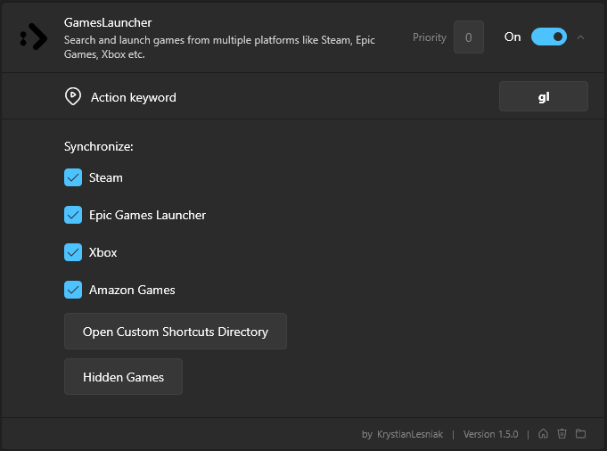

    

***

GamesLauncher is a plugin for [Flow launcher](https://github.com/Flow-Launcher/Flow.Launcher) that simplifies the process of searching for and launching games from multiple libraries. It provides quick and convenient access to your favorite games across various platforms, including Steam, Epic Games, Xbox, Amazon, and more libraries to come.

 

If you like it, consider leaving a star! ⭐

### Supported platforms
* Steam
* Epic Games Launcher
* Xbox
* Ubisoft Connect
* Amazon Games
* [Custom Shortcuts](#custom-shortcuts)

## Installation
In Flow Launcher, use the plugin store to find "GamesLauncher" or type:

    pm install GamesLauncher

## Usage
Just type `gl` command.

Get the last games started:
    
    gl

Search for a games:

    gl <game-title-to-seek>

### Settings
You can disable specific platforms via settings menu.

### Custom shortcuts
If you have retail games (or on an unsupported platform) you can add your own shortcuts files (.lnk / .uri) to the plugin games list.

To do this, go to `Settings -> Plugins -> GamesLauncher -> Open Custom Shortcuts Directory`

Place your shortcut in the opened directory and... That's it! You can now `Reload Plugin Data` to update your library.

### Update library
If you have (un)installed a game, you can update the plugin without restarting Flow Launcher by using the `Reload Plugin Data` command.

### Hide an item
You can hide a specific game from the plugin list by accessing the context menu (`right arrow`) and using the `Hide` command.

The game can be unhidden later from the settings menu.