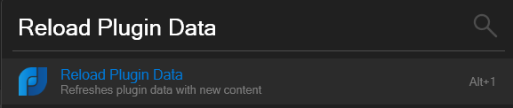

    

***

GamesLauncher is a plugin for [Flow launcher](https://github.com/Flow-Launcher/Flow.Launcher) that simplifies the process of searching for and launching games from multiple libraries. It provides quick and convenient access to your favorite games across various platforms, including Steam, Epic Games, Xbox, and more libraries to come.

### Supported platforms
* Steam
* Epic Games Launcher
* Xbox
* More coming soon...

## Installation
In Flow Launcher, use the plugin store to find "GamesLauncher" or type:

    pm install GamesLauncher

## Usage
Just type `gl` command.

    gl
    gl <game-title-to-seek>

### Settings
You can disable specific platforms via settings menu.

### Update library
If you have (un)installed a game, you can update the plugin without restarting Flow Launcher by using the `Reload Plugin Data` command.

